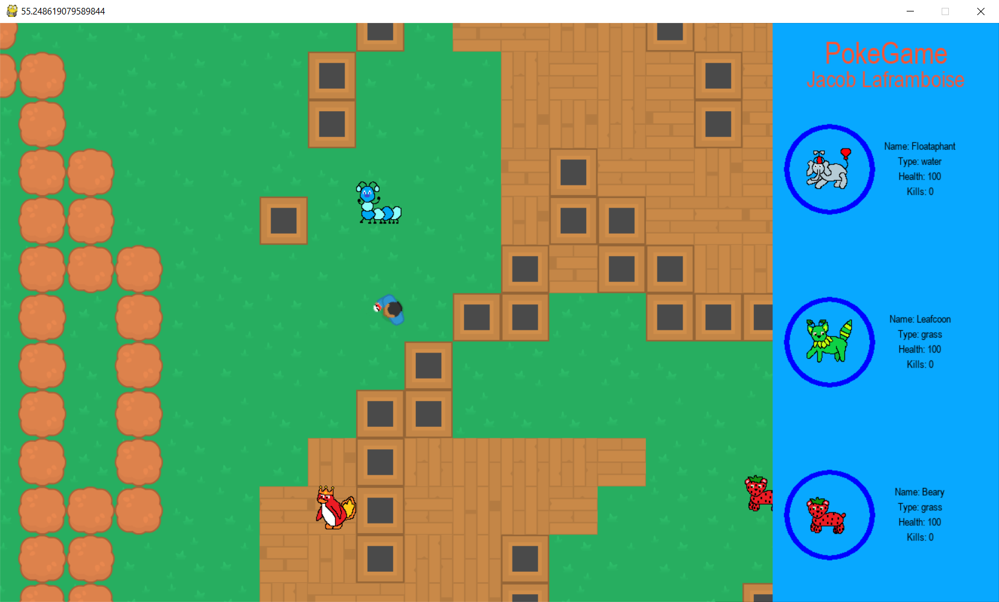
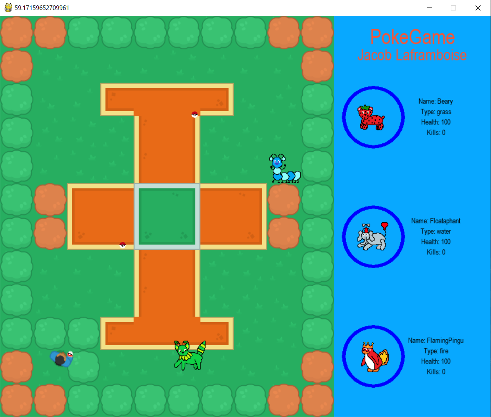

# PokeGame
A Pokemon style game created in Python with PyGame, object oriented programming, and the Tiled map editor.

This project is a Pokémon style game where a player can navigate a map with a mouse and keyboard and interact with Pokémon. The player is able to battle any Pokémon it finds, and capture Pokémon. A battle is a situation where a mini game takes over execution so the player can catch a pokemon. There are different Pokémon available, with unique and shared attributes. 

### Features
- Random pokemon movement
- Player contacts pokemon to initiate a 'battle'
- Player can throw Pokeballs to catch Pokemon
- Player can fight other pokemon using captured Pokemon
- Pokemon have stats like health and damage
- Pokemon get stronger each battle
- Nice intro and outro scenes with animations

---

### Skills used
- Object oriented programming: This work uses OOP for implementing the heirarchy of pokemon and characters, as well as for all other aspects of the game. 
- Animation: There are several components that required simple yet clever math and parameterizing functions to control the motion of animations like on the intro screen and ending screen. 
- Other skills: Python, PyGame, object oriented programming, game design, creativity, map design, Tiled map editor. 

### Project Layout
There are several files in this work:
1. main.py --> Holds classes for the game, the battles, and the intro screen, the draw_health functions, and the main loop.
2. font.py --> Handles all of the major text in the game and assigns appropriate fonts. 
3. menu.py --> Implements the main menu for the game. 
4. outro.py --> Implements the ending scene for the game. 
5. settings.py --> Stores all of the configurable game settings for balancing and debugging the game.
6. sprites.py --> Holds all of the classes for various types of characters and pokemon in the game, using inheritance and polymorphism. 
7. tilemap.py --> Integrates the map generated using Tiled map editor, and uses a camera class to focus the view. 

##### Detailed notes on the developement of this game can be found in 'PlanningWeek4.docx'
